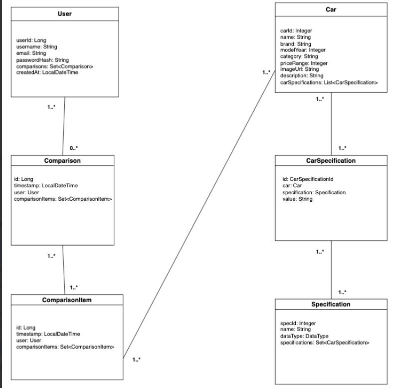

# Car Comparison API

This API provides endpoints for managing cars, comparing their specifications, and tracking comparison history. It is built with Spring Boot and offers functionalities for both users and administrators.

## Technologies Used

* Spring Boot
* Spring MVC
* Spring Data JPA
* MySql Database (or any other configured database)
* Maven

## API Endpoints

### Car Management

* **POST /api/cars**: Create a new car (Admin only).
    * Request body: `CarDTO` object containing car details.
    * Response: The created `Car` object.
* **GET /api/cars/{carId}**: Get details of a specific car by ID.
    * Path variable: `carId` (Integer).
    * Response: The `Car` object.
* **PUT /api/cars/{carId}**: Update an existing car by ID (Admin only).
    * Path variable: `carId` (Integer).
    * Request body: `CarDTO` object with updated car details.
    * Response: The updated `Car` object.
* **DELETE /api/cars/{carId}**: Delete a car by ID (Admin only).
    * Path variable: `carId` (Integer).
    * Response: Success message.
* **GET /api/cars**: List all cars with pagination.
    * Query parameters: `page` (optional, default 0), `size` (optional, default 10).
    * Response: A page of `Car` objects.
* **GET /api/cars/search**: Search for cars based on criteria.
    * Query parameters: `brand`, `model`, `year`, `category`, `priceRange` (all optional).
    * Response: A list of `Car` objects matching the criteria.
* **GET /api/cars/{carId}/suggestions**: Get similar cars for a given car ID.
    * Path variable: `carId` (Integer).
    * Query parameter: `limit` (optional, default 10).
    * Response: A list of similar `Car` objects.

### Car Comparison

* **POST /api/comparisons/compare**: Compare cars based on their specifications.
    * Request body: `CompareRequestDTO` object containing user ID, base car ID, and a list of car IDs to compare.
    * Response: `CompareResponseDTO` object with comparison results.
* **GET /api/comparisons**: Get comparison history for a user.
    * Query parameter: `userId` (Long).
    * Response: A list of `ComparisonHistoryDTO` objects.


## Authentication

* API endpoints that require authentication (e.g., creating or updating cars) should include appropriate security measures (e.g., JWT tokens, API keys).
* The `@CrossOrigin` annotation in `CarComparisonController` allows requests from any origin. Adjust the `origins` property as needed for production environments.


## Project Structure

```
carcomparison/
├── src/
│   ├── main/
│   │   ├── java/
│   │   │   └── com/
│   │   │       └── car360/
│   │   │           └── carcomparison/
│   │   │               └── car_comparison_module/
│   │   │                   ├── CarComparisonApplication.java
│   │   │                   ├── config/
│   │   │                   │   ├── DataInitializer.java
│   │   │                   │   ├── SecurityConfig.java
│   │   │                   │   ├── SwaggerConfig.java
│   │   │                   │   └── UserDetailsServiceConfig.java
│   │   │                   ├── controller/
│   │   │                   │   ├── CarController.java
│   │   │                   │   ├── ComparisonController.java
│   │   │                   │   ├── SpecificationController.java
│   │   │                   │   └── CarSpecificationController.java
│   │   │                   ├── dto/
│   │   │                   │   ├── BaseCarDTO.java
│   │   │                   │   ├── CarDTO.java
│   │   │                   │   ├── CarSpecificationDTO.java
│   │   │                   │   ├── CompareRequestDTO.java
│   │   │                   │   ├── CompareResponseDTO.java
│   │   │                   │   ├── ComparisonHistoryDTO.java
│   │   │                   │   └── SpecificationDTO.java
│   │   │                   ├── exception/
│   │   │                   │   ├── GlobalExceptionHandler.java
│   │   │                   │   └── ResourceNotFoundException.java
│   │   │                   ├── mapper/
│   │   │                   │   └── ManualMapper.java
│   │   │                   ├── model/
│   │   │                   │   ├── Car.java
│   │   │                   │   ├── CarSpecification.java
│   │   │                   │   ├── Comparison.java
│   │   │                   │   ├── ComparisonItem.java
│   │   │                   │   ├── Specification.java
│   │   │                   │   └── User.java
│   │   │                   ├── repository/
│   │   │                   │   ├── CarRepository.java
│   │   │                   │   ├── CarSpecificationRepository.java
│   │   │                   │   ├── ComparisonRepository.java
│   │   │                   │   ├── SpecificationRepository.java
│   │   │                   │   └── UserRepository.java
│   │   │                   └── service/
│   │   │                       ├── CarService.java
│   │   │                       ├── CarServiceImpl.java
│   │   │                       ├── ComparisonService.java
│   │   │                       ├── ComparisonServiceImpl.java
│   │   │                       ├── SpecificationService.java
│   │   │                       ├── SpecificationServiceImpl.java
│   │   │                       ├── UserService.java
│   │   │                       └── UserServiceImpl.java
│   │   └── resources/
│   │       ├── application.properties
│   │       ├── data.sql
│   │       ├── schema.sql
│   │       └── ... (other resource files)
│   └── test/
│       ├── java/
│       │   └── com/
│       │       └── car360/
│       │           └── carcomparison/
│       │               └── car_comparison_module/
│       │                   ├── controller/
│       │                   │   ├── CarControllerTest.java
│       │                   │   ├── ComparisonControllerTest.java
│       │                   │   ├── SpecificationControllerTest.java
│       │                   │   └── CarSpecificationControllerTest.java
│       │                   ├── service/
│       │                   │   ├── CarServiceTest.java
│       │                   │   ├── ComparisonServiceTest.java
│       │                   │   ├── SpecificationServiceTest.java
│       │                   │   └── UserServiceTest.java
│       │                   └── ... (other test classes)
│       └── resources/
│           └── ... (test resource files)
├── pom.xml
```

## Entity Relation UML Diagram:

